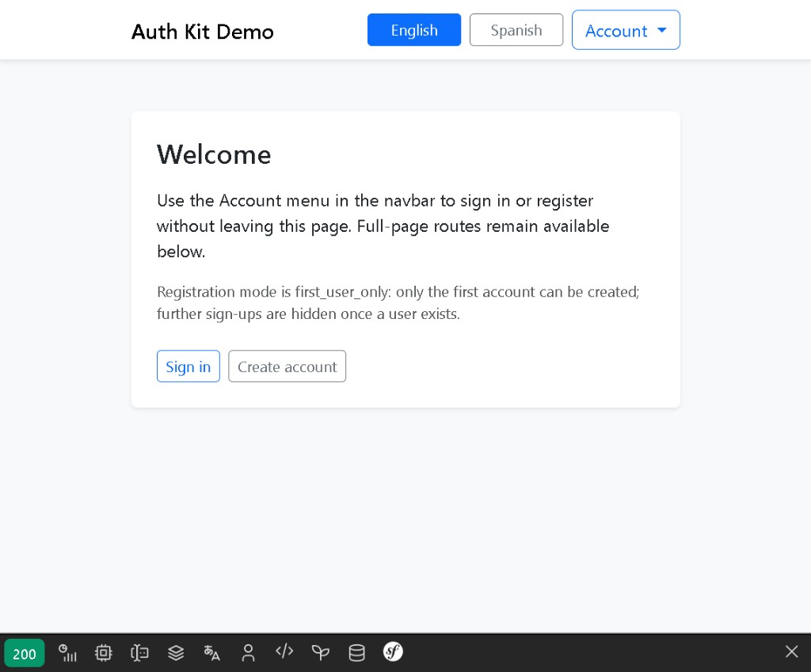
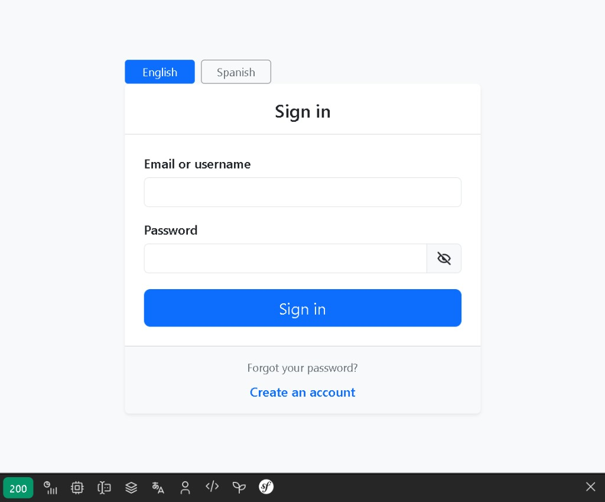
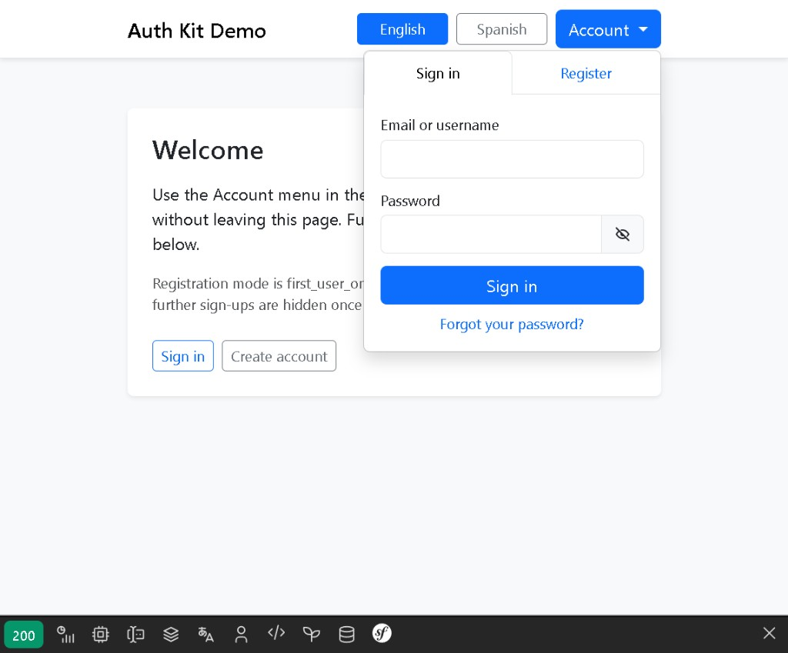

# Auth Kit Bundle

[](https://github.com/nowo-tech/AuthKitBundle/actions/workflows/ci.yml) [](https://packagist.org/packages/nowo-tech/auth-kit-bundle) [](https://packagist.org/packages/nowo-tech/auth-kit-bundle) [](LICENSE) [](https://php.net) [](https://symfony.com) [](https://github.com/nowo-tech/AuthKitBundle) [](#tests-and-coverage)

> ⭐ **Found this useful?** Install from [Packagist](https://packagist.org/packages/nowo-tech/auth-kit-bundle) and give the repo a star on GitHub.

Symfony bundle for **configurable login, registration, and password reset**: overridable Twig templates, registration modes (`disabled`, `first_user_only`, `always`), optional embeddable auth dropdown, locale-prefixed routes, assignable registration role, configurable user entity and form fields, built-in routes, and translations (`en`, `es`).

Works alongside Symfony Security — `security.yaml` remains required and is documented in [INSTALLATION.md](docs/INSTALLATION.md) with optional CLI helper `nowo:auth-kit:configure-security`.

## Features

- Login page compatible with Symfony `form_login`
- Registration with Doctrine persistence and password hashing
- **Password reset** (link, code, or both) with pluggable notifier
- **Embedded auth dropdown** (`auth_kit_dropdown()`) for navbars and layouts
- **Locale in URL paths** (`/en/login`, `/es/register`, …)
- Registration modes: disabled, first user only, always open
- Configurable `user_class`, identifier field, login/register fields, role, routes, templates
- Twig overrides via `templates/bundles/NowoAuthKitBundle/`
- Translation domain `NowoAuthKitBundle` with app overrides

## Installation

```bash
composer require nowo-tech/auth-kit-bundle
```

```yaml
# config/packages/nowo_auth_kit.yaml
nowo_auth_kit:
    user_class: App\Entity\User
    user_identifier_field: email
    registration_mode: first_user_only
    registration_role: ROLE_USER
```

```bash
php bin/console nowo:auth-kit:configure-security
```

## Development

```bash
make up
make test
make release-check
```

## Demo

```bash
make -C demo up-symfony7   # Symfony 7.4 — http://localhost:8009
make -C demo up-symfony8   # Symfony 8.1 — http://localhost:8010
```

Register the first user, then sign in. Demos include **Bootstrap 5** UI overrides, **en/es** locale-prefixed URLs, embed dropdown, password reset, and FrankenPHP (Docker).

### Screenshots

Welcome page with locale switcher and **Account** dropdown:



Full-page login (`/en/login`):



Embedded sign-in inside the navbar dropdown (`auth_kit_dropdown()`):



See [demo/README.md](demo/README.md) for template override paths and [docs/DEMO-FRANKENPHP.md](docs/DEMO-FRANKENPHP.md) for FrankenPHP setup.

## Tests and coverage

- Tests: PHPUnit (unit)
- PHP: 100%
- TS/JS: N/A
- Python: N/A

## License

MIT — see [LICENSE](LICENSE).

## Documentation

- [Installation](docs/INSTALLATION.md)
- [Configuration](docs/CONFIGURATION.md)
- [Usage](docs/USAGE.md)
- [Password reset](docs/PASSWORD-RESET.md)
- [Contributing](docs/CONTRIBUTING.md)
- [Changelog](docs/CHANGELOG.md)
- [Upgrading](docs/UPGRADING.md)
- [Release](docs/RELEASE.md)
- [Security](docs/SECURITY.md)
- [Engram](docs/ENGRAM.md)
- [Spec-driven development](docs/SPEC-DRIVEN-DEVELOPMENT.md)

### Additional documentation

- [Demo with FrankenPHP](docs/DEMO-FRANKENPHP.md)
