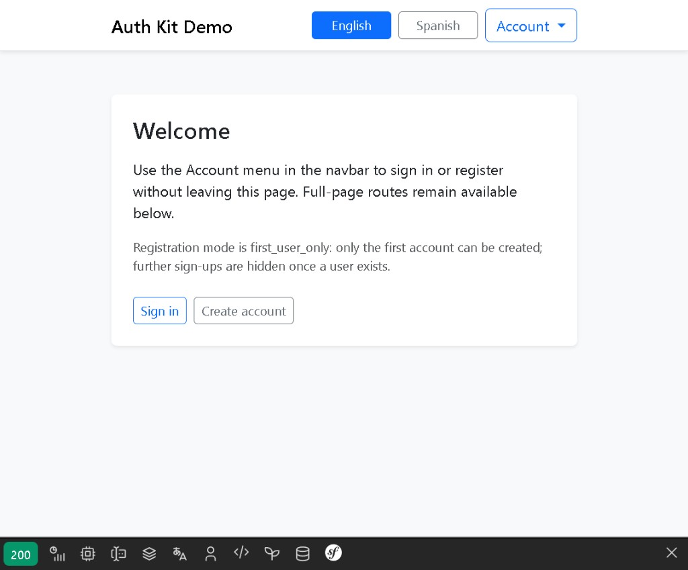
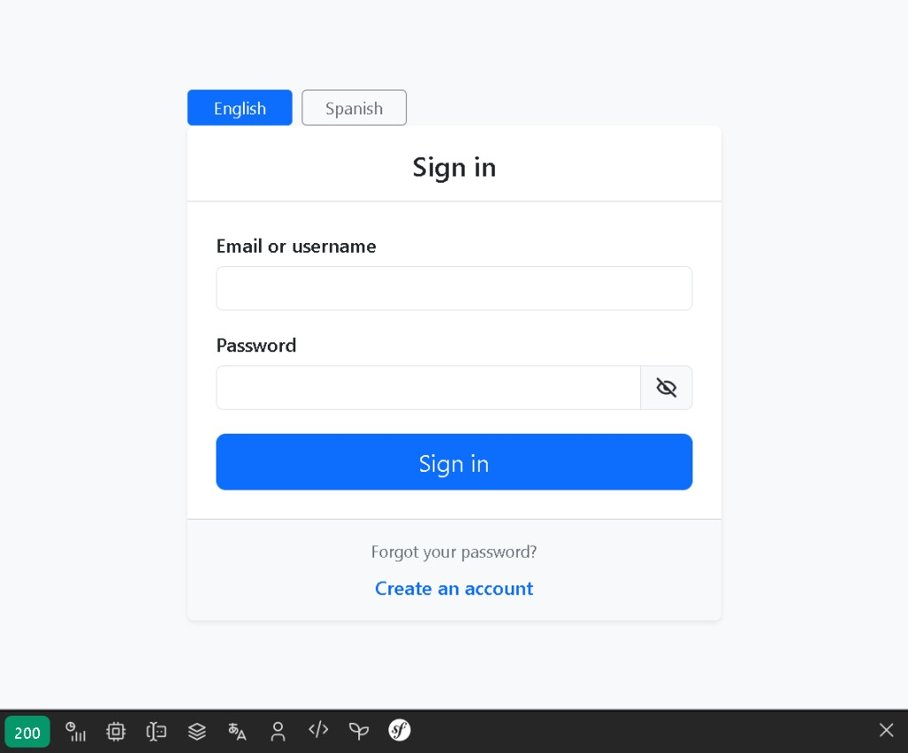
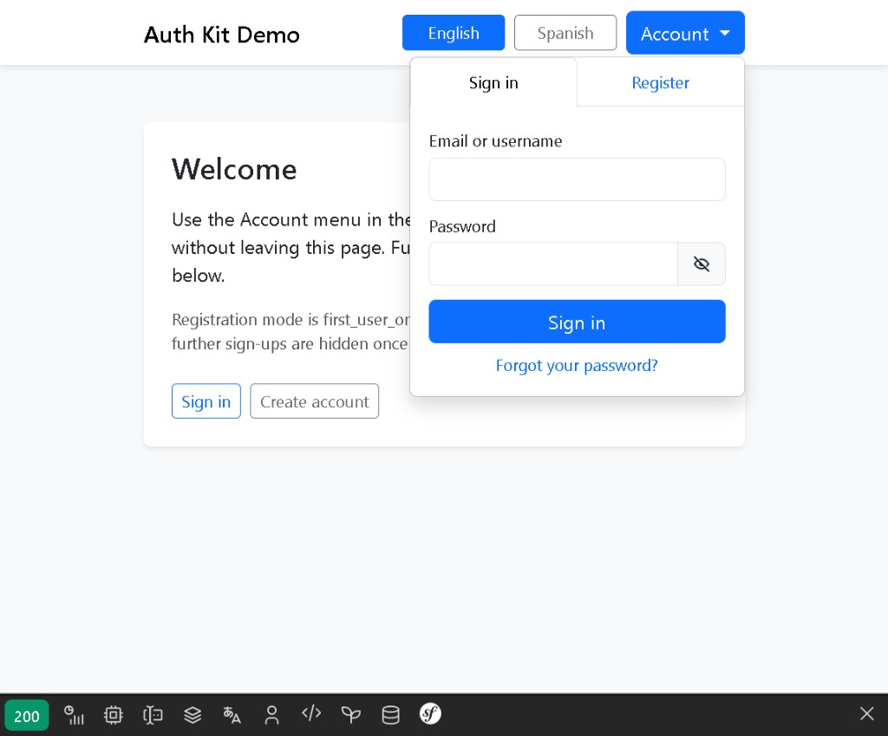

# Auth Kit Bundle

[](https://github.com/nowo-tech/AuthKitBundle/actions/workflows/ci.yml) [](https://packagist.org/packages/nowo-tech/auth-kit-bundle) [](https://packagist.org/packages/nowo-tech/auth-kit-bundle) [](LICENSE) [](https://php.net) [](https://symfony.com) [](https://github.com/nowo-tech/AuthKitBundle) [](#tests-and-coverage)

> ⭐ **Found this useful?** Install from [Packagist](https://packagist.org/packages/nowo-tech/auth-kit-bundle) and give the repo a star on GitHub.

Symfony bundle for **configurable login, registration, and password reset**: overridable Twig templates, registration modes (`disabled`, `first_user_only`, `always`), optional embeddable auth dropdown, locale-prefixed routes, assignable registration role, configurable user entity and form fields, built-in routes, and translations (`de`, `en`, `es`, `fr`, `it`, `nl`, `pt`).
Works alongside Symfony Security — `security.yaml` remains required and is documented in [INSTALLATION.md](docs/INSTALLATION.md) with optional CLI helper `nowo:auth-kit:configure-security`.


This bundle is **FrankenPHP worker mode friendly**.

## Features

- Login page compatible with Symfony `form_login`
- Registration with Doctrine persistence and password hashing
- **Password reset** (link, code, or both) with pluggable notifier
- **Magic login** (passwordless email link via Symfony `login_link`; optional CSRF confirm interstitial)
- **Social login** (OAuth; see [SOCIAL-LOGIN.md](docs/SOCIAL-LOGIN.md))
- **Enterprise SSO (OIDC)** via social credentials + `enterpriseSso` flag (see [SSO.md](docs/SSO.md))
- **QR phone login** (opt-in; see [QR-LOGIN.md](docs/QR-LOGIN.md))
- **WebAuthn / passkeys** — design locked for a later release (see [WEBAUTHN.md](docs/WEBAUTHN.md))
- **Embedded auth dropdown** (`auth_kit_dropdown()`) for navbars and layouts
- **Locale in URL paths** (`/en/login`, `/es/register`, …)
- **Remember me** (optional persistent login cookie)
- **Password strength** (optional integration with `nowo-tech/password-strength-bundle`)
- **Slide to confirm** (optional integration with `nowo-tech/slide-to-confirm-bundle` for registration consent and QR approve)
- Registration modes: disabled, first user only, always open
- **Named profiles** — separate auth config per user entity (`User`, `Admin`, …) with O(1) class resolution
- Configurable `user_class`, identifier field, login/register fields, role, routes, templates
- Twig overrides via `templates/bundles/NowoAuthKitBundle/`
- Translation domain `NowoAuthKitBundle` with app overrides (`de`, `en`, `es`, `fr`, `it`, `nl`, `pt`)

## Installation

```bash
composer require nowo-tech/auth-kit-bundle
```

```yaml
# config/packages/nowo_auth_kit.yaml
nowo_auth_kit:
    default_profile: default
    profiles:
        default:
            user_class: App\Entity\User
            user_identifier_field: email
            registration_mode: first_user_only
            registration_role: ROLE_USER
```

The legacy flat layout (`user_class` at root) remains supported. See [Configuration](docs/CONFIGURATION.md).

```bash
php bin/console nowo:auth-kit:configure-security
```

## Demo

```bash
make -C demo up-symfony8   # Symfony 8.1 — http://localhost:8010
```

Register the first user, then try password login, **password reset**, **magic login**, and **dual locale URLs** (`/en/login` and bare `/login` → redirect). The demo includes **Bootstrap 5** UI overrides, embed dropdown, a session **delivery inbox** (no mailer), and FrankenPHP (Docker).

### Screenshots

<p align="center">
  
  
  
</p>
<p align="center"><sub>Welcome · Login · <code>auth_kit_dropdown()</code></sub></p>

See [demo/README.md](demo/README.md) for template override paths and [docs/DEMO-FRANKENPHP.md](docs/DEMO-FRANKENPHP.md) for FrankenPHP setup (including **worker mode** for production).

## Development

```bash
make up
make test
make release-check
```

## Documentation

- [Installation](docs/INSTALLATION.md)
- [Configuration](docs/CONFIGURATION.md)
- [PSR evaluation (REQ-CS-007)](docs/PSR.md)
- [Usage](docs/USAGE.md)
- [Contributing](docs/CONTRIBUTING.md)
- [Code of Conduct](CODE_OF_CONDUCT.md)
- [Changelog](docs/CHANGELOG.md)
- [Upgrading](docs/UPGRADING.md)
- [Release](docs/RELEASE.md)
- [Security](docs/SECURITY.md)
- [Engram](docs/ENGRAM.md)
- [Spec-driven development](docs/SPEC-DRIVEN-DEVELOPMENT.md)
- [GitHub Spec Kit](docs/SPEC-KIT.md)

### Additional documentation

- [GitHub Actions CI requirements](docs/GITHUB_CI.md)
- [Password reset](docs/PASSWORD-RESET.md)
- [Magic login](docs/MAGIC-LOGIN.md)
- [Social login](docs/SOCIAL-LOGIN.md)
- [QR phone login](docs/QR-LOGIN.md) — opt-in (`mode: disabled` by default; shipped since v1.12)
- [Demo with FrankenPHP](docs/DEMO-FRANKENPHP.md)

## Tests and coverage

- Tests: PHPUnit (unit + integration)
- PHP: 100%
- TS/JS: N/A
- Python: N/A

## License

MIT — see [LICENSE](LICENSE).

